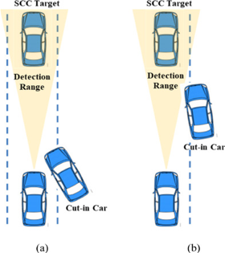
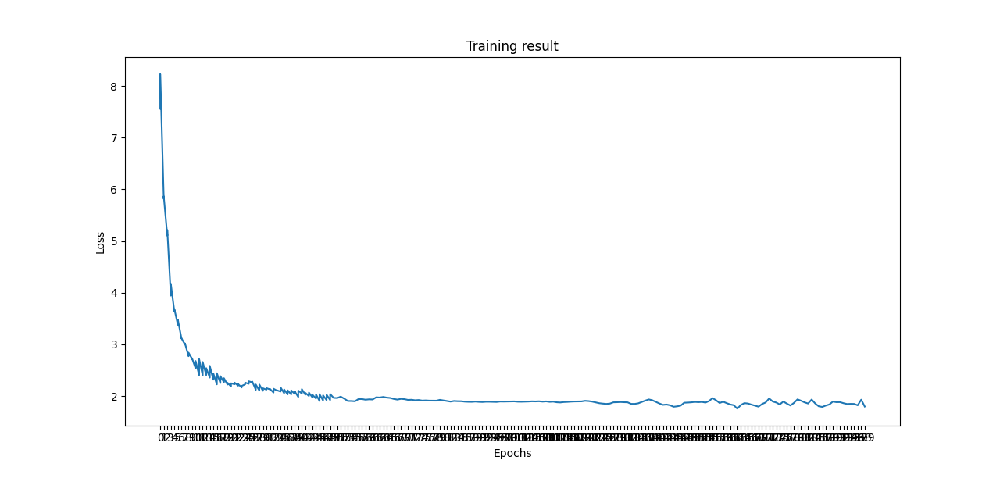
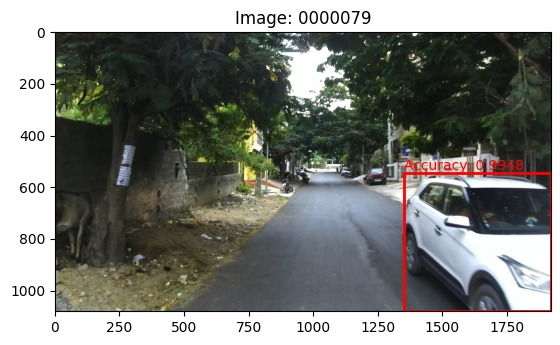
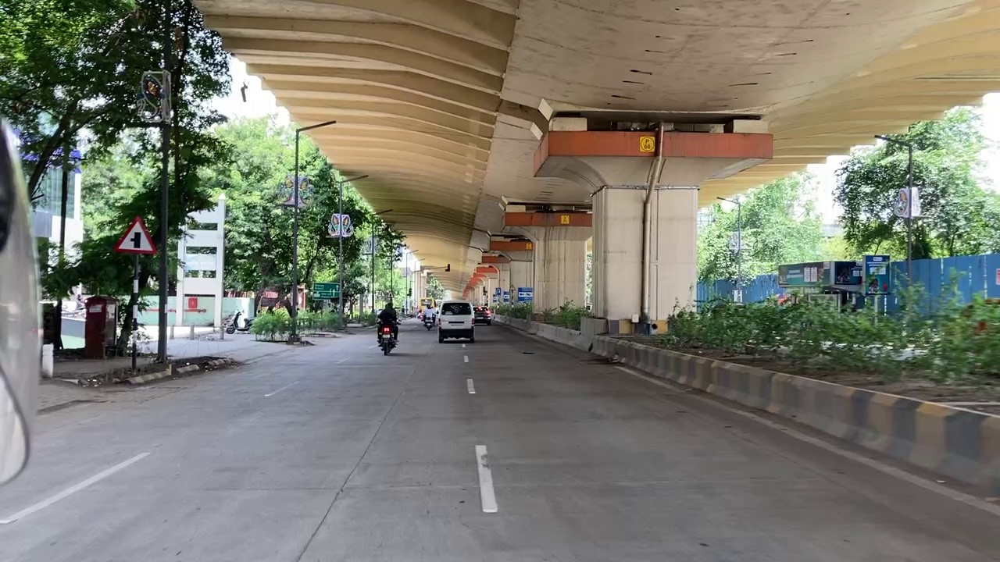
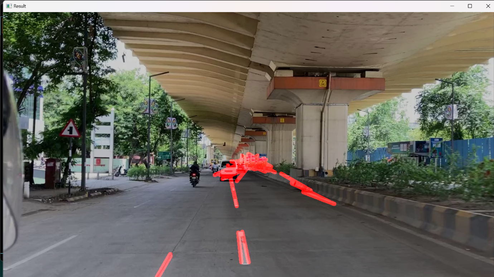

**Problem Statement:** Vehicle Cut-in Detection

**Understanding on Problem Statement:** Vehicle cut-in detection refers to the process of identifying when a vehicle in an adjacent lane moves into the lane directly in front of another vehicle. This is a critical aspect of advanced driver assistance systems (ADAS) and autonomous driving technology, aimed at enhancing road safety and improving driving comfort. Vehicle cut-in detection is a crucial component in the push towards safer and more reliable automated driving systems.

**Objective:** Detect vehicles cutting into the target vehicle's lane and provide early warnings to prevent collisions. Predict potential cut-ins within the specified time frame to alert the driver.

		   

**PROCESS FLOW:**

**SSD MobileNetV1:** The Single Shot MultiBox Detector (SSD) MobileNetV1 combines speed and accuracy for real-time object detection. SSD detects objects in a single pass, while MobileNetV1 is a lightweight convolutional neural network optimized for mobile and embedded vision applications. Together, they form an efficient model for vehicle detection.

**Training Process:-**

**1.Data Preparation:**

Dataset Loading: Load and combine datasets, split into training and validation sets.

Balancing Dataset: Ensure equal representation of each class to prevent bias.

**2.Model Initialization:**

Architecture: Initialize SSD with MobileNetV1.

Pre-trained Weights: Use weights from a model trained on a large dataset like ImageNet to accelerate training.

**3.Training Loop:**

Forward and Backward Pass: Compute loss, perform backpropagation, and update weights.

Logging: Track training progress and losses.

**5.Model Saving:**

Periodically save the model to resume training or evaluate performance.

**Evaluation Process:-**

**1.Validation Dataset Preparation:**

Prepare a separate validation dataset.

**2.Evaluation Metrics:**

Loss Calculation:** Compute loss on the validation dataset.

Mean Average Precision (mAP):** The detection performance was evaluated with an mAP of 0.643. The model was trained and evaluated using a batch size of 32 over 200 epochs.

		   

**3.Logging and Saving Models:**

Log validation losses and mAP.

Periodically save model checkpoints.

The model was implemented to detect multiple classes, including animals and people. However, due to class imbalance in the dataset, the mean Average Precision (mAP) for these classes was low. To address this issue and enhance detection performance, it was crucial to balance the dataset across all classes. Consequently, the resultant accuracy was calculated for the vehicle class.

**Lane detection**: Python program designed for lane detection in both static images and videos using computer vision techniques. The program uses the OpenCV library for image processing tasks, employing edge detection and the Hough Transform algorithm to identify lane lines.

**Steps and Explanation for Image:**

**1.Importing Libraries**

cv2: The OpenCV library used for image processing tasks.

numpy: Used for numerical operations on arrays.

**2.Reading the Image**

Load the image using cv2.imread.

**3.Grayscale Conversion**

Convert the image to grayscale with cv2.cvtColor.

**4.Gaussian Blur**

Apply Gaussian Blur to reduce noise using cv2.GaussianBlur.

**5.Edge Detection**

Use the Canny edge detection algorithm with cv2.Canny.

**6.Creating and Applying a Mask**

Create a mask with a region of interest and apply it using cv2.bitwise\_and.

**7.Line Detection using Hough Transform**

Use cv2.HoughLinesP to detect lines with parameters for distance resolution, angle resolution, vote threshold, minimum line length, and maximum line gap.

**8.Drawing Lines**

Define a function to draw lines on the image using cv2.line.

**Steps for Video Detection**

**1.Importing Libraries**

Same as for static images.

**2.Defining Helper Functions**

Region of Interest: Define and apply a region of interest.

Drawing Lines: Draw detected lines on the frame.

**3.Processing Each Frame**

Convert the frame to grayscale.

Apply Gaussian Blur.

Use Canny edge detection.

Define and apply the region of interest.

Use Hough Transform to detect lines.

Draw detected lines and overlay them on the original frame with cv2.addWeighted.

The code successfully detects and highlights lane lines in a video stream by applying a series of image processing techniques. The combination of edge detection and Hough Transform provides an efficient method for identifying and drawing lane lines, making it suitable for applications such as autonomous driving and road monitoring systems.

**This process ensures effective lane detection for both static images and videos using computer vision techniques.**

**

**Future Directions:**

1. **Integrated Lane and Vehicle Detection**: Explore methods to combine outputs from lane detection and vehicle detection modules to enhance overall scene understanding and robustness. Develop algorithms that leverage lane information to improve the accuracy of vehicle cut-in detection by considering lane-changing behaviors and trajectories.

1. **Optimization for Limited Hardware**: Investigate the optimization of detection algorithms to leverage GPU acceleration, enabling real-time processing and extending the feasibility of deployment on resource-constrained platforms.

1. **Enhanced Sensor Fusion:** Integrate data from diverse sensors (LIDAR, RADAR, cameras) to provide comprehensive environmental perception, enhancing the accuracy and reliability of detection systems.

1. **Scalability and Deployment**: Design the detection system with a modular architecture that supports easy integration into different vehicle platforms and scalable deployment scenarios. Ensure the detection system's adaptability across various vehicle types and sizes, accommodating different sensor configurations and mounting positions.

**TechnologiesUsed:**

**1.SSD (Single Shot Multi-box Detector):** A fast and efficient object detection algorithm that predicts bounding boxes and class scores in a single pass, ideal for real-time applications.

**2.MobileNetV1 Backbone :** A lightweight convolutional neural network optimized for mobile and embedded vision applications, using depth-wise separable convolutions to reduce parameters and computational cost. 

**3.TensorFlow:** An open-source machine learning framework by Google, providing tools for building, training, and deploying models.

**4.Object Detection API:** A framework within TensorFlow offering pre-trained models and utilities for customizing and deploying object detection models.

**5.Python**

**6.Key Libraries:**

`  `NumPy: Numerical computations.

`  `OpenCV Image processing and computer vision.

**7.Development Environment**

`   `Anaconda: A distribution for scientific computing that simplifies package management.

`   `PyCharm: An integrated development environment (IDE) for Python, facilitating efficient code development and        debugging.

**8. Visualization and Monitoring Tools**

`   `Tensor-Board: A TensorFlow tool for monitoring and visualizing metrics during training.

**9. Source Control Management**

`   `Git: A distributed version control system for tracking source code changes.

`   `GitHub: A platform for hosting and sharing Git repositories, facilitating collaboration and version management.

**10.YOLOv8:** Used YOLOv8 for real-time object detection, offering improved speed, accuracy, and efficiency with optimized deep learning architecture

## Code and Implementation
### Vehicle Detection- 

### Lane Detection-

**Team members and contribution:**

**1.Arya Hotey: Vehicle Detection using SSD MobileNetV1** The Single Shot MultiBox Detector (SSD) model is initialized with MobileNet V1 as the base network, setting up the architecture and loading pre-trained weights from ImageNet to provide a strong starting point for training.** Evaluation process** include preparing the validation dataset, implementing metrics such as loss calculation and Mean Average Precision (mAP).

**2.Shrushti Barhate : Data Preparation and Documentation** Tasks include loading and parsing datasets like Open Images and VOC, ensuring balanced datasets for effective training. Documentation included research on valid algorithms providing a comprehensive framework for implementing the vehicle cut-in detection project, aimed at enhancing road safety.

**3.Parth Bomanwar : Dataset Generation and Annotation** Tasks included data collection, preprocessing, annotation, and quality control, addressing the challenges and ensuring optimal outcomes for vehicle detection. Tasks included accurate and consistent labelling of data to get effectiveness and reliability of the detection algorithms.

**4.Khyati Singh: Lane Detection** The project involved using OpenCV in Python for lane detection on static images and video frames. Tasks included defining the region of interest, applying Gaussian Blur and Canny edge detection, and using the Hough Transform algorithm to identify and draw lane lines on the road.

**5.Chetan Dongre: Data Collection and Research** Tasks included gathering and organizing datasets for lane detection, ensuring data quality, and conducting research to identify the most effective methods and algorithms for lane detection.

**Conclusion:**

This project developed a robust system for vehicle cut-in detection and lane detection using advanced computer vision and deep learning techniques. It utilized the Single Shot MultiBox Detector (SSD) with MobileNetV1 backbone for efficient and accurate real-time vehicle detection in applications such as advanced driver assistance systems (ADAS) and autonomous driving. Data preparation involved balancing multiple datasets to effectively train the SSD model. Optimization techniques, including the Multibox Loss function and Stochastic Gradient Descent (SGD) optimizer with tuned hyperparameters, enhanced training effectiveness. Model performance was validated using metrics like Mean Average Precision (mAP), ensuring reliability in real-world scenarios. For lane detection, the project employed the OpenCV library to process static images and video frames, using edge detection and the Hough Transform algorithm to dynamically identify and highlight lane lines. This implementation represents a significant advancement in automated driving systems, enhancing both safety and driving comfort.

**References:**

1\.Data has been collected from IDD official website: Dataset Name: IDD Multimodal - Primary (6.5 GB).

2\.Joy, S., B S, M., Mukesh, T. B., Ahmed, M. M., & Kiran, U. (2022). Real Time Road Lane Detection using Computer Vision Techniques in Python. In *2022 International Conference on Automation, Computing and Renewable Systems (ICACRS)*. IEEE. DOI: 10.1109/ICACRS55517.2022.10029238

3\.Ghaeini, H. R., & Tippenhauer, N. O. (2022). Smooth Transition of Vehicles’ Maximum Speed for Lane Detection based on Computer Vision. In *2022 IEEE 96th Vehicular Technology Conference (VTC2022-Fall)* (pp. xxx-xxx). IEEE. DOI: 10.1109/VTC2022-Fall57202.2022.10012739

